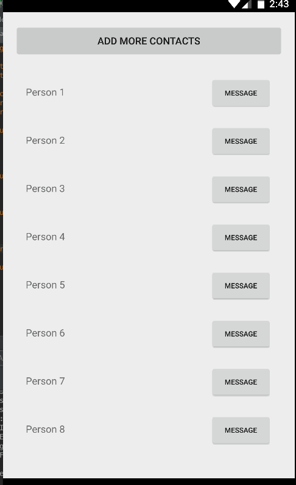
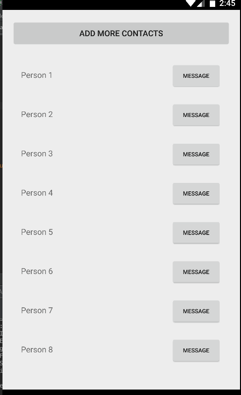

# RecyclerView Demo
This is a simple contacts app to demonstrate how to display a list of objects using a `RecyclerView`.



## Contact Model
Ask students to copy the following `Contact` model:

```
public class Contact {
    private String mName;
    private boolean mOnline;

    public Contact(String name, boolean online) {
        mName = name;
        mOnline = online;
    }

    public String getName() {
        return mName;
    }

    public boolean isOnline() {
        return mOnline;
    }

    private static int lastContactId = 0;

    public static List<Contact> createContactsList(int numContacts) {
        List<Contact> contacts = new ArrayList<>();

        for (int i = 1; i <= numContacts; i++) {
            contacts.add(new Contact("Person " + ++lastContactId, i <= numContacts / 2));
        }

        return contacts;
    }
}
```

## Key Demonstration Points

### Recycled items
Without re-enabling the button on each call to `onBindViewHolder`, the button will retain the state from the last contact that was displayed in its `ViewHolder`.

This can be demonstrated by scrolling to the bottom of the list and back up.  Enabled buttons at the top of the list will now be disabled.

```java
    // In Contact.java

    @Override
    public void onBindViewHolder(ViewHolder viewHolder, int position) {
        Contact contact = mContacts.get(position);

        TextView textView = viewHolder.nameTextView;
        textView.setText(contact.getName());

        Button button = viewHolder.messageButton;

        if (contact.isOnline()) {
            button.setText("Message");

            // OMIT to show that rows are recycled.
            //
            // Scrolling past the midpoint of the list (when contacts are listed as offline)
            // and scrolling back up should result in some buttons being inadvertently disabled.
            button.setEnabled(true);
        }
        else {
            button.setText("Offline");
            button.setEnabled(false);
        }
    }
```



### Notifying the adapter that the UI must be updated due to dataset changes
Without the call to `notifyItemRangeInserted`, the UI will not reflect the additional contacts that have been appended to the contact list.

```java
    // In Contact.java

    public void addMoreContacts(List<Contact> newContacts) {
        int insertionPosition = mContacts.size();
        mContacts.addAll(newContacts);

        // OMIT to illustrate how the UI is independent from the dataset
        // and does not update automatically.
        notifyItemRangeInserted(insertionPosition, newContacts.size());
    }
```


